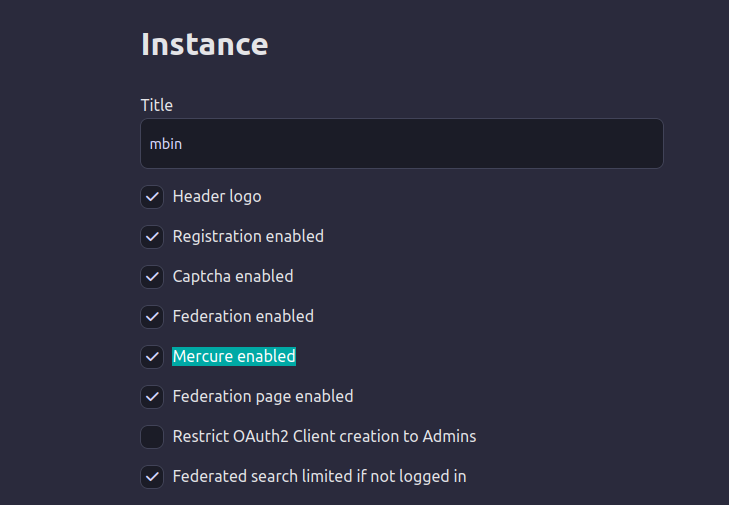

# Mercure

Mercure is used in Mbin for real-time communication between the server and the clients

More info on [Mercure Website](https://mercure.rocks/)

## Installation

> [!TIP]
> The following instructions is for bare metal installation.  
> For docker installation, Mercure is already included in Caddy used by `www` service.

Download and install Mercure (we are using [Caddyserver.com](https://caddyserver.com/download?package=github.com%2Fdunglas%2Fmercure) mirror to download Mercure):

```bash
sudo wget "https://caddyserver.com/api/download?os=linux&arch=amd64&p=github.com%2Fdunglas%2Fmercure%2Fcaddy&idempotency=69982897825265" -O /usr/local/bin/mercure
sudo chmod +x /usr/local/bin/mercure
```

Prepare folder structure with the correct permissions:

```bash
cd /var/www/mbin
mkdir -p metal/caddy
sudo chmod -R 775 metal/caddy
sudo chown -R mbin:www-data metal/caddy
```

[Caddyfile Global Options](https://caddyserver.com/docs/caddyfile/options)

> [!NOTE]
> The provided Caddyfile should work for most people, edit Caddyfile and Supervisor mercure.conf as needed.

Add new `Caddyfile` file, with the following contents:

```bash
nano metal/caddy/Caddyfile
```

```conf
{
    {$GLOBAL_OPTIONS}
    # No SSL needed
    auto_https off
    http_port {$HTTP_PORT}
    persist_config off

    log {
        # DEBUG, INFO, WARN, ERROR, PANIC, and FATAL
        level WARN
        output discard
        output file /var/www/mbin/var/log/mercure.log {
            roll_size 50MiB
            roll_keep 3
        }

        format filter {
            wrap console
            fields {
                uri query {
                    replace authorization REDACTED
                }
            }
        }
    }
}

{$SERVER_NAME:localhost}

{$EXTRA_DIRECTIVES}

route {
    mercure {
        # Transport to use (default to Bolt with max 1000 events)
        transport_url {$MERCURE_TRANSPORT_URL:bolt://mercure.db?size=1000}
        # Publisher JWT key
        publisher_jwt {env.MERCURE_PUBLISHER_JWT_KEY} {env.MERCURE_PUBLISHER_JWT_ALG}
        # Subscriber JWT key
        subscriber_jwt {env.MERCURE_SUBSCRIBER_JWT_KEY} {env.MERCURE_SUBSCRIBER_JWT_ALG}
        # Workaround for now
        anonymous
        # Extra directives
        {$MERCURE_EXTRA_DIRECTIVES}
    }

    respond /healthz 200
    respond "Not Found" 404
}
```

Ensure not random formatting errors in the Caddyfile

```bash
mercure fmt metal/caddy/Caddyfile --overwrite
```

Configure Supervisor job for running Mercure

```bash
sudo nano /etc/supervisor/conf.d/mercure.conf
```

With the following content:

```ini
[program:mercure]
command=/usr/local/bin/mercure run --config /var/www/mbin/metal/caddy/Caddyfile
process_name=%(program_name)s_%(process_num)s
numprocs=1
environment=MERCURE_PUBLISHER_JWT_KEY="{!SECRET!!KEY!-32_3-!}",MERCURE_SUBSCRIBER_JWT_KEY="{!SECRET!!KEY!-32_3-!}",SERVER_NAME=":3000",HTTP_PORT="3000"
directory=/var/www/mbin/metal/caddy
autostart=true
autorestart=true
startsecs=5
startretries=10
user=www-data
redirect_stderr=false
stdout_syslog=true
```

Save and close the file. Restart supervisor jobs:

```bash
sudo supervisorctl reread && sudo supervisorctl update && sudo supervisorctl start all
```

In the NGINX site config, ensure the following block exists to proxy Mercure endpoint:

```nginx
    location /.well-known/mercure {
        proxy_pass http://127.0.0.1:3000$request_uri;
        # Increase this time-out if you want clients have a Mercure connection open for longer (eg. 24h)
        proxy_read_timeout 2h;
        proxy_http_version 1.1;
        proxy_set_header Connection "";

        proxy_set_header X-Forwarded-For $proxy_add_x_forwarded_for;
        proxy_set_header X-Forwarded-Host $host;
        proxy_set_header X-Forwarded-Proto $scheme;
    }
```

## Enable Mercure

Enable (or disable) Mercure in the Mbin Admin settings:


